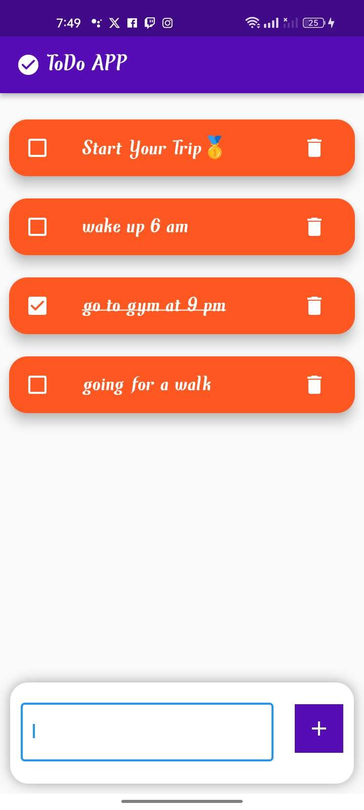

# Simple To-Do App (appqu)


## Description

This is a Flutter application called that  ```appqu```demonstrates the creation of a simple to-do list app using Flutter's built-in `setState` method for managing state. The app allows users to add and delete tasks from their to-do list.

## Features

- Add new tasks to the to-do list
- Mark tasks as completed
- Delete tasks
- Clean and intuitive user interface

## Screenshots




## Installation

To run this application on your local machine, make sure you have Flutter installed. Then follow these steps:

1. Clone this repository to your local machine using:
   ```
   git clone https://github.com/your-username/todo-app.git
   ```

2. Navigate to the project directory:
   ```
   cd todo-app
   ```

3. Install the required dependencies:
   ```
   flutter pub get
   ```

4. Run the app on an emulator or physical device:
   ```
   flutter run
   ```

## Dependencies

The main dependencies used in this project are:

- None (since the app uses Flutter's built-in `setState` for state management)

For more details, refer to the `pubspec.yaml` file.
